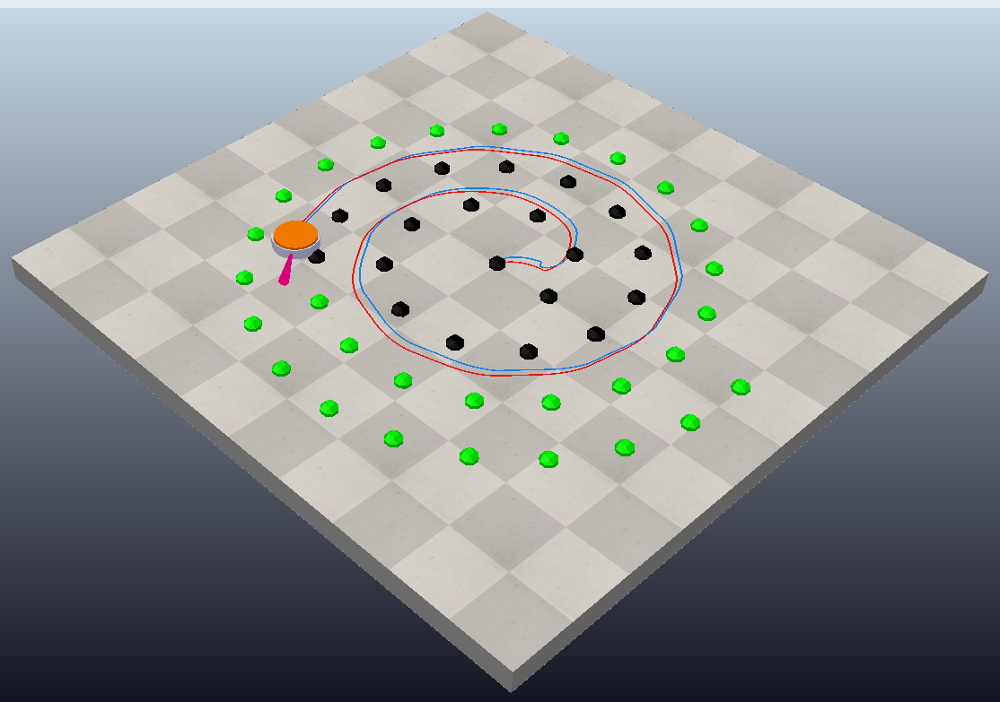

# Vacuum Cleaner Robot Simulation (CoppeliaSim + Python)

This repository contains two Python scripts for simulating a **vacuum cleaner robot** in **CoppeliaSim**.  
Both scripts support **manual control**, **autonomous navigation**, and **odometry visualization**, but each uses a different strategy for autonomous movement:  

1. **Reactive obstacle avoidance** (random turns).  
2. **Systematic coverage using spiral waypoints**.  

---

## 1. Vacuum Cleaner Robot — Obstacle Avoidance Mode

Scene file: `lvk_obstacle_avoidance.ttt`

Watch on YouTube:

### Algorithmic Behavior
The robot mimics the behavior of a simple household vacuum cleaner:

- **Manual mode**:  
  - User controls the robot with the keyboard (W/S = forward/backward, A/D = turn, SPACE = stop, Q = quit) or via a small UI panel with sliders for velocities.  
  - Commands are applied through differential-drive kinematics.  

- **Autonomous mode**:  
  - The robot performs **randomized obstacle avoidance**, a typical strategy in low-cost robotic vacuum cleaners.  
  - Sensors:  
    - **Proximity sensor** (detects walls/furniture).  
    - **Step sensors** (detect stairs/cliffs).  
    - **Bumper** (detects physical collisions).  
  - When an obstacle is detected:  
    - The robot stops forward motion.  
    - Executes either a random turn (45°–180°) or a forced 180° turn if a step is detected.  
    - Resumes straight-line cleaning when clear.  
  - Timeout logic prevents endless turning loops.  

Additional features:  
- **Odometry trail** (red) showing estimated path.  
- **Pose logging** (x, y, yaw) for debugging.  

### Flow-Style Outline
1. **Initialization**  
   - Load robot and sensors.  
   - Create UI and reset odometry.  

2. **Control Loop**  
   - **If manual** → follow user inputs.  
   - **If autonomous**:  
     - Sense obstacles.  
     - If none → move forward at max speed.  
     - If detected → stop and perform avoidance turn.  

3. **Sensing & Update**  
   - Integrate odometry from wheel encoders.  
   - Periodically log pose.  
   - Optionally draw odometry trail.  

4. **Cleanup**  
   - Remove UI and drawings.  

---

## 2. Vacuum Cleaner Robot — Spiral Coverage Mode

Scene file: `lvk_navigation.ttt`

Watch on YouTube:

### Algorithmic Behavior
This script models a more systematic vacuum cleaner with **coverage navigation** using **spiral waypoints**:

- **Manual mode**:  
  - Same as above (keyboard or UI-based control).  

- **Autonomous mode**:  
  - Generates waypoints along an **Archimedean spiral** to cover the cleaning area.  
  - Navigation to each waypoint uses a **go-to-point controller**:  
    - Large heading error → rotate in place until aligned.  
    - Moderate error → proportional angular correction with reduced forward motion.  
    - Small error → move straight at nominal speed.  
  - Each waypoint is marked **completed** once reached within tolerance.  
  - If stuck too long, the waypoint is skipped, and the robot proceeds with the next.  

Additional features:  
- **Odometry trail** (red) and **ground-truth trail** (blue).  
- **Waypoint markers**: green (pending) and black (completed).  
- **Periodic logs** for current pose and goals.  

### Flow-Style Outline
1. **Initialization**  
   - Generate spiral waypoints (CW or CCW).  
   - Build UI and draw waypoint markers.  

2. **Control Loop**  
   - **If manual** → apply user inputs.  
   - **If autonomous**:  
     - Select next spiral waypoint.  
     - Compute heading and distance.  
     - Decide motion:  
       - Rotate, correct, or move straight depending on error.  
     - Mark waypoint as reached if within tolerance.  
     - Skip if stuck for too long.  

3. **Sensing & Update**  
   - Update odometry from encoders.  
   - Draw trails (red odometry, blue ground truth).  
   - Update waypoint markers (green → black).  
   - Log pose and goal progress.  

4. **Cleanup**  
   - Remove UI, markers, and trails.  

---
