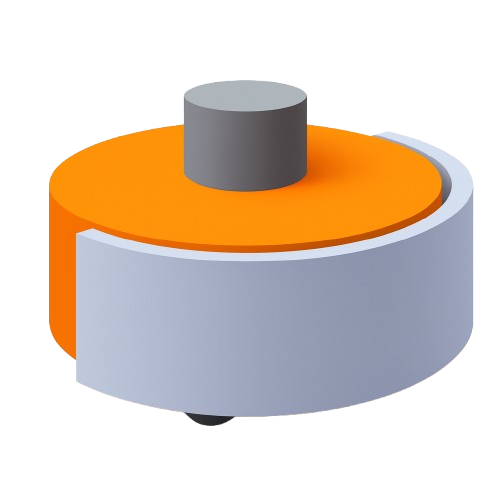

# Vacuum Cleaner Robot Simulation (CoppeliaSim + Python) 

  

This repository contains three Python scripts for simulating a **vacuum cleaner robot** in **CoppeliaSim**.  
All scripts support **manual or autonomous navigation** patterns commonly found in household robots and include odometry-based updates.

1. **Goal-based navigation with reactive obstacle avoidance** — [Read more](sim-1-goal-based-navigation.md)
2. **Pure reactive obstacle avoidance** (randomized turns) — [Read more](sim-2-obstacle-avoidance.md)
3. **Systematic area coverage using spiral waypoints** — [Read more](sim-3-spiral-coverage.md)
4. **ROS 2 Bumper Test** — [Read more](test-bumper/ROS2-bumper-test.md)
5. **Autonomous Docking** — [Read more](autodocking/README.md)
6. **ROS2 Autonomous Docking** — [Read more](ros2-autodocking/ros2-autodocking.md)
7. **ROS 2 Bringup Example** — [Read more](myrobot_bringup_ws/README.md)
8. **Semantic Room Segmentation Final Project** — [Read more](final_project/README.md)
