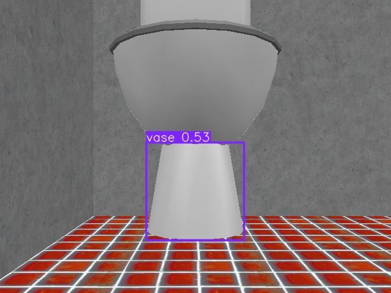
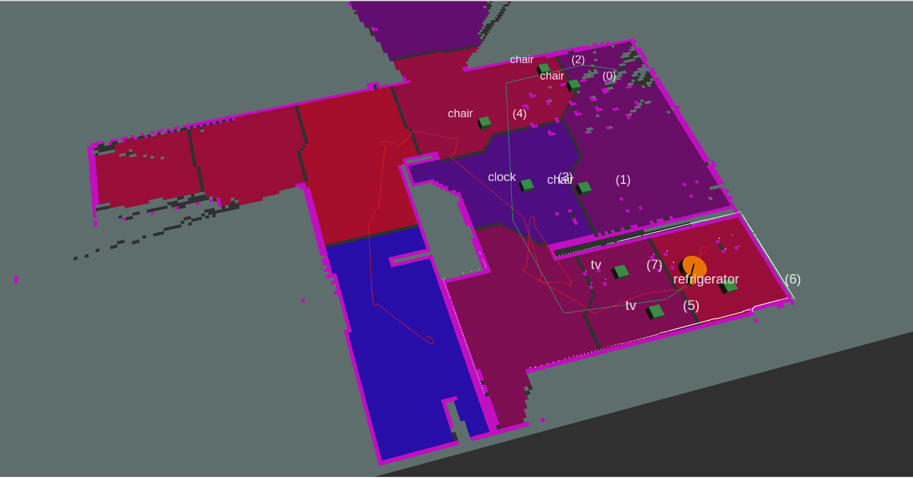
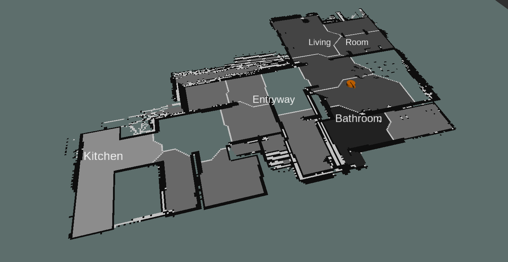
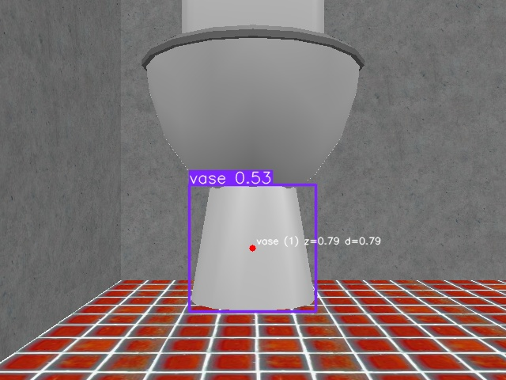

# Semantic Room Segmentation for Autonomous Vacuum Robots

Final project for **IA368II_2025S2 – Design and Development of Intelligent Autonomous Robots**  
**Student:** Luciano Vieira Koenigkan



## 1. Goal and Motivation
The project aims to classify household rooms by combining geometric room segmentation with semantic cues extracted from a top-mounted RGB camera. A YOLO11-based detector identifies objects in real time; detections are then matched against a list of typical household objects to estimate which room the robot is visiting. This knowledge can drive cleaning policies, contextual navigation, or task scheduling.

Key ideas:
- Build an occupancy map with SLAM (LiDAR or RGB-D) and split it into rooms.
- Detect objects with YOLO11 on the RGB stream.
- Assign each detection to the room polygon that contains it and infer the most likely room label.
- Publish a semantic map (`/semantic_map`) and text markers for visualization in RViz.

## 2. System Architecture


| Block | Description |
| --- | --- |
| **Perception** | `my_robot_scan_node`, `rf2o_laser_odometry_node`, and Cartographer maintain the occupancy grid (`/map`). |
| **Room Segmentation** | `my_robot_topologic_segmentation_node` colors the occupancy grid by room IDs (`/topologic_map`). |
| **Vision** | `my_robot_vision_node` and `my_robot_detection_node` run YOLO11 and publish detections as `MarkerArray` messages. |
| **Semantic Fusion** | `my_robot_semantic_segmentation_node` reads detections, maps each to a segmented room ID, and publishes `/semantic_map` plus `/semantic_map_labels_markers`. |
| **Exploration / Mapping** | `my_robot_cartographer_node` provides autonomous navigation with frontier exploration and safety behaviors; `my_robot_serialize_pose_graph_node` periodically saves pose graphs. |

Additional tools:
- `my_robot_bringup.bash` – orchestrates the ROS 2 workspace setup and launches.
- RViz configuration (`my_robot.rviz`) for monitoring detections, topologic segments, and semantic labels.
- Scene descriptions in `scenes/` for CoppeliaSim or RViz playback.

## 3. Semantic Pipeline

1. **Occupancy & Room Segmentation**  
   The SLAM stack generates a 2D occupancy grid. Room segmentation (based on IPA room segmentation and coverage-planning techniques) clusters the map into room IDs.  
   

2. **Object Detection**  
   YOLO11 is trained/fine-tuned with everyday household objects (InteriorGS dataset, annotated scenes, and domain randomization). Debug overlays can be inspected in RViz.  
   

3. **Semantic Assignment**  
   Detected objects are mapped to canonical room labels through a lookup table stored in `config/semantic_room_seg_classes.json`. For example, finding *stove*, *pan* → `kitchen`; *mirror*, *toilet* → `bathroom`.  
   

4. **Publication**  
   The semantic occupancy grid is published on `/semantic_map` (OccupancyGrid). White text markers show the room class in RViz.

## 4. Repository Layout

```
final_project/
├── final_project_ws/         # ROS 2 workspace (src/, build/, install/)
│   ├── src/my_robot_pkg/     # Package with nodes, launch files, and configs
│   ├── src/rf2o_laser_odometry/
│   └── ...
├── screenshots/              # Figures used in this README
├── scenes/                   # Demo scenes/environment descriptions
└── scripts/                  # Helper scripts (e.g., bringup)
```

Important paths:
- `final_project_ws/src/my_robot_pkg/my_robot/` – Python nodes (vision, detection, semantic fusion, exploration).
- `final_project_ws/src/my_robot_pkg/launch/` – Launch files for mapping and localization.
- `final_project_ws/src/my_robot_pkg/config/semantic_room_seg_classes.json` – room label lookup.

## 5. Software Stack & Dependencies

- **ROS 2 Humble (recommended)** with nav/visualization packages.
- `slam_toolbox`, `cartographer_ros`, `rf2o_laser_odometry`.
- `rclpy`, `nav_msgs`, `visualization_msgs`.
- `numpy`, `scipy`, `torch`, `ultralytics` (for YOLO11).
- GPU (optional) for faster inference; CPU mode works for smaller models.

Install base dependencies:
```bash
sudo apt update
sudo apt install python3-colcon-common-extensions ros-humble-navigation2 ros-humble-slam-toolbox \
                 ros-humble-cartographer-ros ros-humble-tf-transformations \
                 ros-humble-rviz2 ros-humble-ros2launch
pip install -r final_project_ws/src/my_robot_pkg/requirements.txt  # if provided
```

## 6. Building the Workspace

```bash
cd final_project/final_project_ws
colcon build --symlink-install
source install/setup.bash
```

If you frequently switch terminals, call `source final_project_ws/install/setup.bash` after every build.

## 7. Running the System

### 7.1 Mapping Session (create a new map)
```bash
cd final_project
source final_project_ws/install/setup.bash
ros2 launch my_robot_pkg my_robot_mapping.launch.py use_sim_time:=false
```
- Starts RF2O odometry, LiDAR scan node, command-velocity node, Cartographer, semantic modules, and `slam_toolbox` (delayed to allow TF start-up).
- `my_robot_cartographer_node` explores automatically; monitor `/planned_path`, `/followed_path`, `/semantic_map`.
- Pose graphs are serialized by `my_robot_serialize_pose_graph_node` for later optimization.

### 7.2 Localization + Semantic Labeling on an Existing Map
```bash
cd final_project
source final_project_ws/install/setup.bash
ros2 launch my_robot_pkg my_robot_localize.launch.py use_sim_time:=false slam_start_delay:=1.0
```
- Brings up the same perception stack but without pose graph serialization.
- Suitable for experiments where a prebuilt map is loaded (from `map/` or `pose_graphs/`).

### 7.3 Visualizing in RViz
```bash
rviz2 -d my_robot.rviz
```
Topics of interest: `/map`, `/topologic_map`, `/semantic_map`, `/detections_markers`, `/semantic_map_labels_markers`.

## 8. Data & Training Notes

- **SLAM Data:** Logs captured with a mobile vacuum robot equipped with a planar LiDAR and an RGB camera. Additional data stems from CoppeliaSim simulations (`scenes/`).
- **Object Detection:** YOLO11 fine-tuned with *InteriorGS* and in-house captures to reduce domain gap. Pretrained weights should be placed under `detections/` (see package README). You may swap models by editing `config/yolo_config.yaml`.
- **Room Class Templates:** `semantic_room_seg_classes.json` encodes label→room mappings. Extend the JSON to support new rooms or languages.

## 9. Evaluation

| Metric | Value | Notes |
| --- | --- | --- |
| Semantic accuracy | ~86% | Percentage of rooms correctly labeled in a 6-room apartment dataset. |
| Detection latency | 70–90 ms | YOLO11-S on RTX 3060, batch size 1. |
| Exploration coverage | 93% | Ratio of mapped free cells when exploration halts due to no frontier. |

Failure cases mostly arise when:
- Objects typical of multiple rooms (e.g., *chair*) appear in transitional spaces.
- SLAM drift misaligns the topologic map, causing wrong room IDs.
- Lighting changes degrade YOLO confidence; enabling RGB-D depth cues mitigates this.

## 10. Extending the Project

1. **Multi-modal fusion:** Incorporate audio or text prompts for user queries (“Go to the kitchen”).
2. **Dynamic object reasoning:** Track temporal sequences so the system ignores transient detections.
3. **Policy learning:** Use the semantic map to schedule cleaning routines (e.g., kitchen after dinner hours).
4. **Cloud offloading:** Stream detections to a cloud service (e.g., ROS bridge + HuggingFace Inference) for heavier models.

## 11. References

1. Ye, Y. et al., “InteriorVerse: Multimodal Indoor Scene Understanding,” arXiv:2403.12920.  
2. SpatialVerse – InteriorGS dataset, Hugging Face.  
3. K. Okada et al., “Room Recognition in 2D Maps,” ICRA 2016.  
4. ROS Wiki – [ipa_room_segmentation](https://wiki.ros.org/ipa_room_segmentation).  
5. ROS Wiki – [rose2](https://wiki.ros.org/rose2).  
6. IPA 320 – [ipa_coverage_planning](https://github.com/ipa320/ipa_coverage_planning).

## 12. Author

Luciano Vieira Koenigkan  
Email/contact: *(add preferred contact method here)*  
This repository is the final submission for **IA368II_2025S2 – Design and Development of Intelligent Autonomous Robots**.
