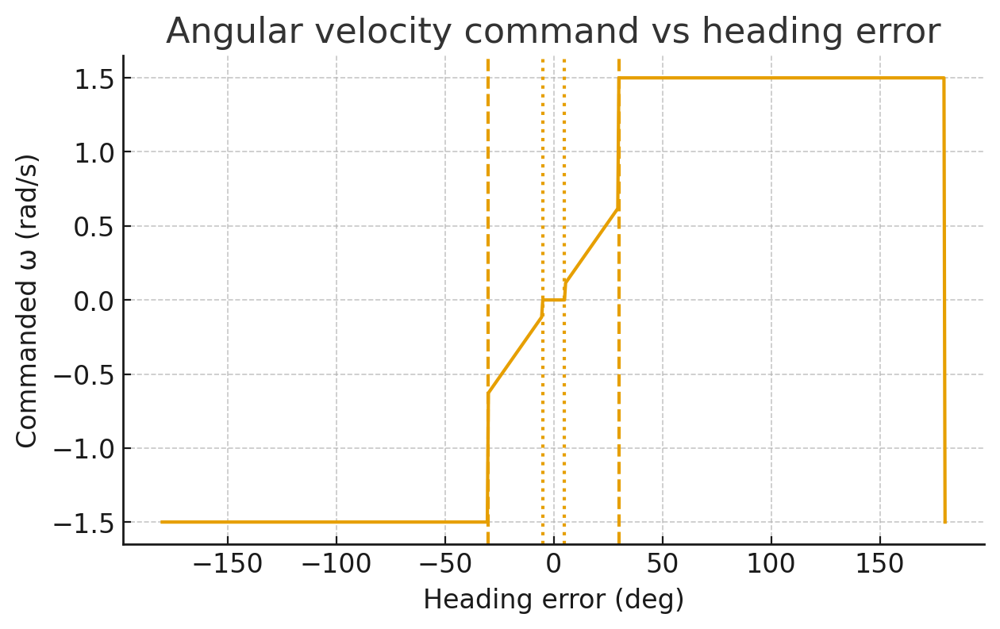
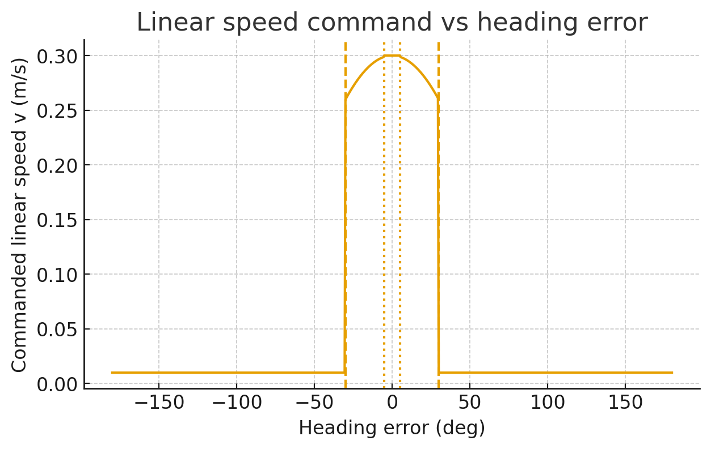
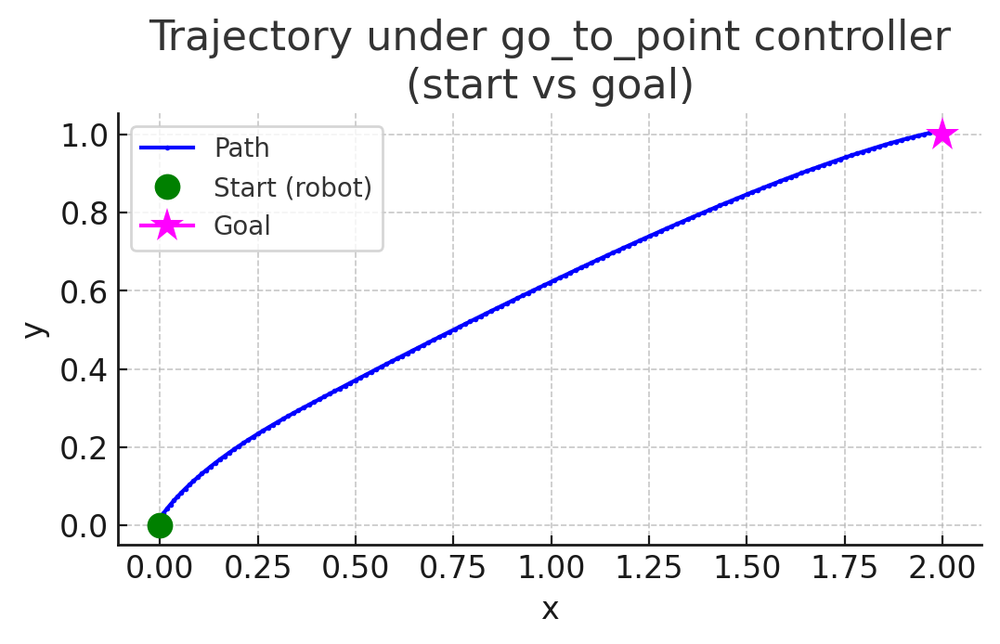

# `go_to_point` Controller

This controller moves a differential-drive robot from its current pose `(x, y, yaw)` to a target `goal = (x, y)`.

---

## How it works

1. **Check distance**  
   - If the robot is closer than `tolerance` to the goal, both wheels stop → **goal reached**.

2. **Compute heading error**  
   - Using `angle_to_goal`, the angular difference between the robot's forward (+Y in CoppeliaSim) and the goal direction.

3. **Select regime based on |error|**  

   | Condition | Behavior |
   |-----------|-----------|
   | \|error\| > `heading_pure_rot_thresh_deg` | **Pure rotation**: rotate in place at `close_turn_omega_max` until roughly aligned. |
   | `heading_linear_only_thresh_deg` ≤ \|error\| ≤ `heading_pure_rot_thresh_deg` | **Turn while moving**: proportional correction (`omega = gain * error`), forward velocity reduced depending on misalignment. |
   | \|error\| < `heading_linear_only_thresh_deg` | **Straight line**: move forward at `v`, no rotation. |

4. **Wheel velocity mapping**  
   Convert linear velocity `v` and angular velocity `ω` into wheel speeds:
   \[
   v_r = v + \frac{L}{2}\omega, \quad v_l = v - \frac{L}{2}\omega
   \]  
   then wheel angular velocities:
   \[
   \omega_r = \frac{v_r}{r}, \quad \omega_l = \frac{v_l}{r}
   \]

5. **Saturation**  
   Both wheel velocities are clamped to `±wheel_omega_limit`.

---

## Control Laws (vs Heading Error)

The controller uses a **piecewise law** for angular (`ω`) and linear (`v`) commands as a function of heading error.

### Angular velocity command

  

- Far from alignment → constant rotation (`±close_turn_omega_max`).  
- Moderate misalignment → proportional correction.  
- Near alignment → 0.

### Linear velocity command

  

- Far from alignment → almost stop (`v ≈ 0.01`).  
- Moderate error → slowed down proportional to `cos(error)` (but ≥70% of nominal).  
- Well aligned → full speed `v`.

---

## Example Trajectory

Below: simulated trajectory starting with the robot facing west (yaw = 90°, pointing −X), with the goal at (2, 1).  

  

- First, the robot **rotates toward the goal**.  
- Then it **moves in an arc** (turn while moving).  
- Finally, it **drives straight** into the goal.  

---

## Summary

- **Pure rotation** handles large errors.  
- **Turn while moving** gently corrects medium errors.  
- **Straight line** maximizes forward progress when nearly aligned.  

This simple piecewise controller ensures smooth goal convergence without oscillations or overshoot.
