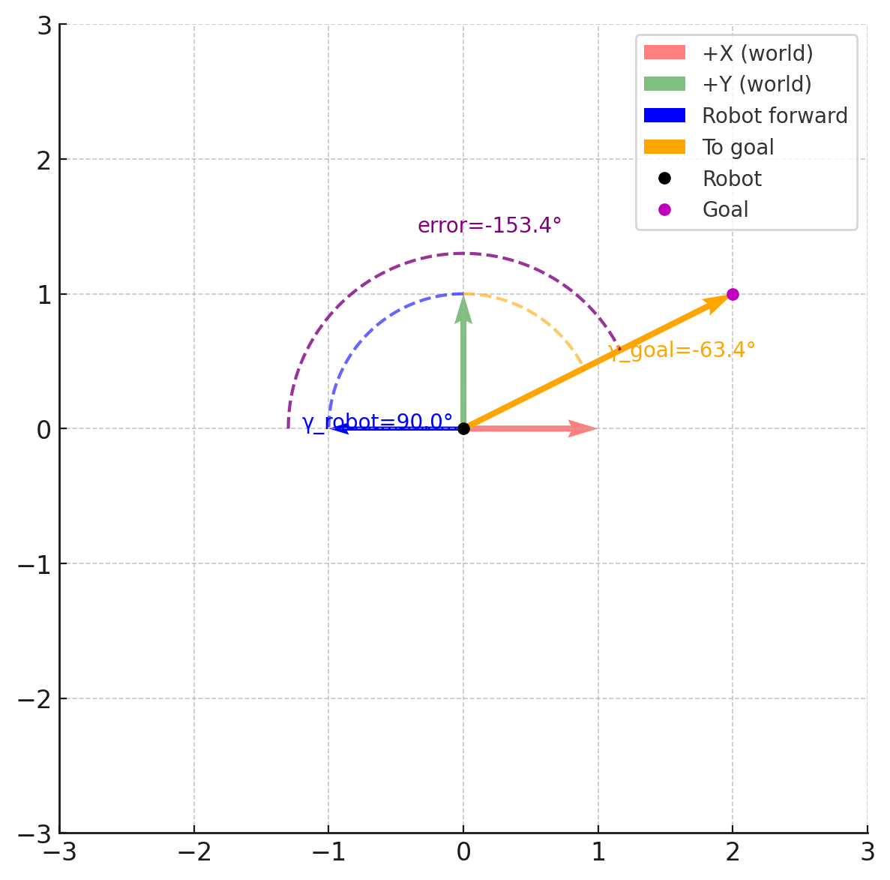

# Goal-Based Navigation + Reactive Obstacle Avoidance (with Temporary Avoidance Goals)

Scene file: `myRobot.ttt`

Watch on YouTube:

**Script focus:** navigate to a list of randomly placed goals, avoiding obstacles by inserting **temporary local avoidance goals** ahead/aside of the robot, then resuming the original goal list.

## Algorithmic Behavior
- **Go-to-point controller (`go_to_point`)**  
  - Computes distance and heading error to the target.  
  - **Large heading error (> 90°)** → pure rotation in place with capped angular velocity; tiny forward bias to avoid stalling.  
  - **Moderate error (5°–90°)** → proportional angular correction with clipped ω and reduced linear speed (uses `cos(error)` to taper).  
  - **Small error (< 5°)** → straight-line motion at nominal `v` with **no** angular correction to minimize drift.  
  - Converts (v, ω) into per-wheel angular speeds with saturation and applies them to motors.  
  - Declares **arrival** when within a tolerance radius and stops both wheels.

  See details: [go_to_point controller](go_to_point.md)

- **Obstacle handling (proximity sensor)**  
  - On detection, the robot **creates a temporary avoidance goal** in front, offset laterally (left/right) and slightly beyond the obstacle distance.  
  - If already avoiding and a new obstacle is seen, it **removes the current goal** and keeps the lateral side consistent to prevent oscillation.  
  - After reaching the avoidance goal, it resumes the normal goal list.

- **Goal management (`GoalManager`)**  
  - Maintains an ordered list of goals with operations: get current, advance to next, insert before current, remove current, reset.  
  - Ends the simulation when all goals are completed.

- **Utilities**  
  - `angle_to_goal`: computes goal/robot angles and normalized error in CoppeliaSim’s frame (yaw=0 → +Y).  
  

  
  

- `local_to_world`: transforms offsets from robot frame to world frame.  
  - Random **obstacle generation** with non-overlapping cuboids (AABB checks), color/props set for detection/collision.

## Execution Flow
1. **Initialization**  
   - Load robot, motor, sensor, and goal-marker handles.  
   - Spawn **N obstacles** randomly without overlap.  
   - Generate **N goals** uniformly in workspace; initialize `GoalManager`.  
   - Set current goal and place a visible goal marker.

2. **Control Loop (Actuation)**  
   - Read proximity sensor → `(detected, distance, …)`.  
   - **If obstacle detected**:  
     - If already avoiding → remove current goal; choose a **consistent lateral offset**.  
     - Else → choose random side (left/right).  
     - Compute **avoidance waypoint** in front+lateral using `local_to_world` and **insert before current**.  
     - Set current goal to the avoidance waypoint; mark “avoidance started”.  
   - Call `go_to_point` to drive toward `current_goal`.  
   - **On arrival**:  
     - If it was avoidance → clear avoidance flag; resume original goal.  
     - Else → log “goal reached”.  
     - Advance to next goal (if any), update goal marker; otherwise **stop simulation**.

3. **Sensing & Update**  
   - (Optional) Add odometry/trail and periodic logging.

4. **Cleanup**  
   - Remove generated objects if needed; stop simulation gracefully.
